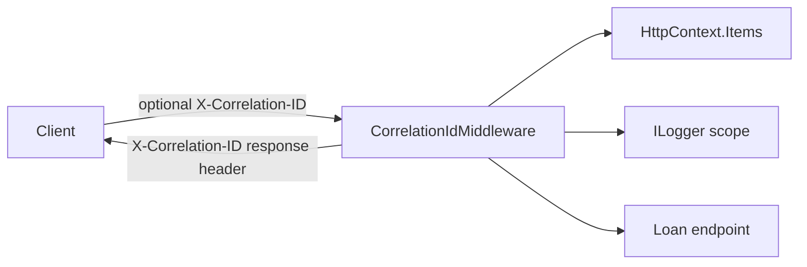
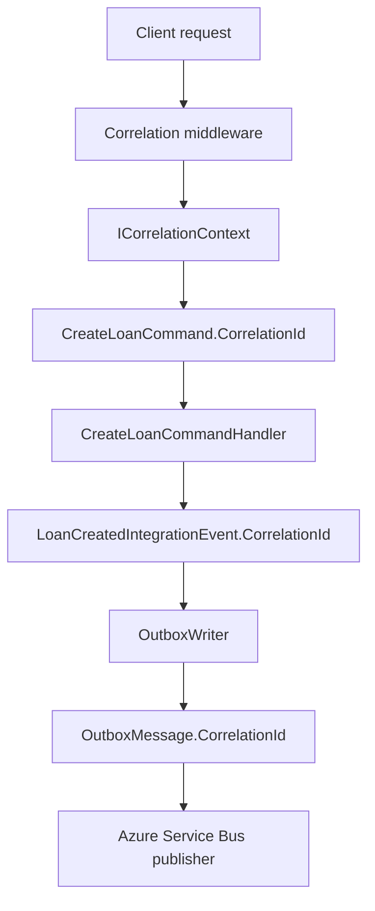
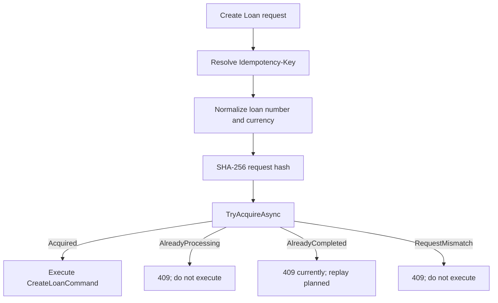

# EnterpriseLoanAI — Story Implementation Log

This log records the technical implementation history of EnterpriseLoanAI engineering stories. The GitHub Project board remains the source of truth for workflow status; this document explains what the repository actually implements, why it was designed that way, how it is tested, and what remains incomplete.

The evidence reviewed for this edition includes the current branch `feature/elai-205-implement-duplicate-request-detection`, the working tree, source and test projects, EF Core migrations, all local and remote story branches, Git history, merged pull requests, and GitHub issues. Statements about in-progress work describe the current uncommitted working tree and must be reviewed again before ELAI-205 is merged.

## Current Progress

| Story | Description | Status | PR |
|---|---|---|---|
| ELAI-201 | Implement Correlation ID Middleware | Done | [#142](https://github.com/ankitsharma7996/EnterpriseLoanAI/pull/142) |
| ELAI-202 | Propagate Correlation ID into Commands and Outbox Events | Done | [#143](https://github.com/ankitsharma7996/EnterpriseLoanAI/pull/143) |
| ELAI-203 | Define Idempotency-Key API Contract | Done (story status); repository discrepancy noted below | No PR found |
| ELAI-204 | Add Idempotency Persistence Model | Done | [#144](https://github.com/ankitsharma7996/EnterpriseLoanAI/pull/144) |
| ELAI-205 | Implement Duplicate Request Detection | In Progress | [#145](https://github.com/ankitsharma7996/EnterpriseLoanAI/pull/145) (draft) |

# ELAI-201 — Implement Correlation ID Middleware

## Status

Done. Merged to `main` in PR [#142](https://github.com/ankitsharma7996/EnterpriseLoanAI/pull/142) through merge commit `6cf4731`. The feature commits are `7145e48` and `188650a`.

## Goal

Give every HTTP request a stable correlation identifier that is available to downstream code, included in structured logging scope, and returned to the caller.

## Problem

Without a request-wide identifier, logs and failures from a distributed loan workflow cannot be reliably connected. Clients also need a response value they can supply to support and operations teams.

## Architecture

`CorrelationIdMiddleware` runs before endpoint execution. It accepts a valid GUID from `X-Correlation-ID`; otherwise it generates a new GUID. It stores the resolved value in `HttpContext.Items`, opens an `ILogger` scope, and registers the response header through `Response.OnStarting`.



Using `OnStarting` ensures the response header is applied immediately before headers are sent, including when downstream middleware or endpoints determine the final response.

## Implementation

- Header name: `X-Correlation-ID`.
- Accepted caller value: a parseable GUID.
- Missing or invalid values: replaced with a newly generated non-empty GUID.
- Request storage: `HttpContext.Items["CorrelationId"]`.
- Logging: the resolved GUID is added to a scoped `CorrelationId` property.
- Application access: `HttpCorrelationContext` implements `ICorrelationContext` and reads the GUID from the active HTTP context.
- Missing HTTP context or an uninitialized item produces an explicit `InvalidOperationException`; it does not silently invent a second ID.

## Tests

`CorrelationIdMiddlewareTests` verifies generation, preservation of a valid supplied GUID, replacement of an invalid value, storage in `HttpContext.Items`, downstream visibility, and response-header behavior. `HttpCorrelationContextTests` verifies successful access and failure when context is unavailable or not initialized.

## Engineering Decisions

- Correlation IDs are GUIDs, unlike idempotency keys, which are opaque strings.
- One resolved value is shared by response metadata, downstream code, and logging.
- The application abstraction avoids coupling application handlers to ASP.NET Core.
- Invalid external values are replaced rather than trusted.

## Reliability and Concurrency

The middleware creates request-local state only; it does not coordinate concurrent requests. Its purpose is observability and causal tracing, not duplicate suppression.

## Source Locations

- `src/Services/LoanService/LoanService.Api/Middleware/CorrelationIdMiddleware.cs`
- `src/Services/LoanService/LoanService.Api/Context/HttpCorrelationContext.cs`
- `src/Services/LoanService/LoanService.Application/Abstractions/Context/ICorrelationContext.cs`
- `tests/Services/LoanService/LoanService.Api.Tests/Middleware/CorrelationIdMiddlewareTests.cs`
- `tests/Services/LoanService/LoanService.Api.Tests/Context/HttpCorrelationContextTests.cs`

## Remaining Limitations or Follow-up Work

The current implementation propagates correlation through the implemented HTTP-to-outbox path. Broader propagation conventions for future inbound transports and outbound HTTP calls are not yet present.

# ELAI-202 — Propagate Correlation ID into Commands and Outbox Events

## Status

Done. Merged to `main` in PR [#143](https://github.com/ankitsharma7996/EnterpriseLoanAI/pull/143) through merge commit `c4b308a`. The implementation commits are `3694486` and `dcd8d2c`.

## Goal

Preserve the HTTP correlation identifier across the Create Loan application command, integration event, and durable outbox record.

## Problem

Generating a correlation ID only at the HTTP boundary is insufficient if it is lost before asynchronous work begins. A published event must retain the originating request identity so operations can trace work across transaction and broker boundaries.

## Architecture



The command handler creates the loan and integration event, adds both to the same `LoanDbContext`, and calls the unit of work once. This preserves the transactional-outbox boundary: business data and the message intended for publication are committed together.

## Implementation

- `CreateLoanCommand` carries a required `Guid CorrelationId`.
- `CreateLoanCommandHandler` copies the command value into `LoanCreatedIntegrationEvent`.
- `IIntegrationEvent` exposes correlation metadata used by infrastructure.
- `OutboxWriter` serializes the runtime event and passes its correlation ID to `OutboxMessage.Create`.
- `OutboxMessage` persists the value and rejects `Guid.Empty`.
- `HttpCorrelationContext` supplies the middleware-created ID at the endpoint boundary.

## Database and Schema Changes

ELAI-202 uses the existing outbox schema's `CorrelationId` field. No story-specific migration is visible in its commits; the work wires the already modeled value through the execution path.

## Tests

`CorrelationIdPersistenceTests` covers both caller-supplied and server-generated IDs, sends a Create Loan request, and verifies that the exact response/request correlation value is stored in the outbox record. The feature also retained unit coverage for the HTTP correlation context.

## Engineering Decisions

- Correlation is explicit in the command and event contracts rather than retrieved from ambient HTTP state inside the application handler.
- The outbox row is the durable handoff point for asynchronous publication.
- Missing HTTP correlation context fails explicitly, preventing an event from being persisted with an unrelated replacement value.

## Reliability and Concurrency

Correlation does not make delivery exactly once. It makes retries and at-least-once processing diagnosable. The transactional outbox prevents the loan commit and event-intent commit from diverging.

## Source Locations

- `src/Services/LoanService/LoanService.Api/Endpoints/Loans/CreateLoanEndpoint.cs`
- `src/Services/LoanService/LoanService.Application/Loans/CreateLoan/CreateLoanCommand.cs`
- `src/Services/LoanService/LoanService.Application/Loans/CreateLoan/CreateLoanCommandHandler.cs`
- `src/Services/LoanService/LoanService.Application/Loans/Events/LoanCreatedIntegrationEvent.cs`
- `src/Services/LoanService/LoanService.Infrastructure/Messaging/OutboxWriter.cs`
- `src/Services/LoanService/LoanService.Infrastructure/Persistence/Outbox/OutboxMessage.cs`
- `tests/Services/LoanService/LoanService.Api.Tests/Integration/CorrelationIdPersistenceTests.cs`

## Remaining Limitations or Follow-up Work

Consumer-side trace continuation is outside the current Loan Service implementation. Future consumers must read and scope the persisted correlation ID when processing the event.

# ELAI-203 — Define Idempotency-Key API Contract

## Status

The supplied project status says Done. Commit `8f43d89` on `feature/elai-203-idempotency-key-api-contractm` contains the completed contract implementation and tests. However, that commit is not an ancestor of the current `main`, and no matching pull request or merge commit was found. Parts of the contract currently reappear as uncommitted ELAI-205 working-tree files. This is a repository-history discrepancy that should be resolved before ELAI-205 is merged.

## Goal

Define a predictable HTTP contract for idempotent Create Loan requests without prescribing a client-specific key format.

## Problem

Duplicate detection cannot work reliably unless clients provide a stable key and the API consistently rejects missing, blank, or unbounded values.

## Architecture

The API boundary resolves `Idempotency-Key` before command execution. `IdempotencyHeaders` centralizes the header name and maximum length; `IdempotencyKeyResolver` validates and returns the trimmed key. The key remains transport metadata and is not embedded in the business command.

## Implementation

Evidence in commit `8f43d89` shows:

- Required header: `Idempotency-Key`.
- Missing header: `400 Bad Request`.
- Empty or whitespace-only header: `400 Bad Request`.
- Maximum length: 128 characters.
- Values longer than 128 characters: `400 Bad Request`.
- Valid values are trimmed.
- Keys are opaque strings. A GUID is accepted, but GUID formatting is not required.
- `BadHttpRequestException` is translated to a JSON 400 response by `ExceptionHandlingMiddleware` in the story commit.

## Database and Schema Changes

None in ELAI-203. Persistence and uniqueness are introduced by ELAI-204.

## Tests

`IdempotencyKeyContractTests` in commit `8f43d89` covers missing, empty, over-128-character, GUID, and non-GUID opaque keys. The commit also introduces a shared API test factory and adjusts correlation integration requests for the new required header.

## Engineering Decisions

- The server does not interpret client key semantics; it only validates presence and bounded storage size.
- Opaque keys permit UUIDs, workflow IDs, or other client-generated stable tokens.
- Trimming occurs at the boundary so persistence receives the canonical header value.
- The 128-character boundary agrees with the later ELAI-204 database column.

## Reliability and Concurrency

The contract identifies retries but does not itself acquire ownership. Atomic ownership depends on ELAI-204's database constraint and ELAI-205's acquisition logic.

## Source Locations

On commit `8f43d89`:

- `src/Services/LoanService/LoanService.Api/Idempotency/IdempotencyHeaders.cs`
- `src/Services/LoanService/LoanService.Api/Idempotency/IdempotencyKeyResolver.cs`
- `src/Services/LoanService/LoanService.Api/Middleware/ExceptionHandlingMiddleware.cs`
- `tests/Services/LoanService/LoanService.Api.Tests/Integration/IdempotencyKeyContractTests.cs`
- `tests/Services/LoanService/LoanService.Api.Tests/Integration/LoanServiceApiFactory.cs`

The first two files also exist as uncommitted files on the current ELAI-205 branch. The current working-tree exception middleware does not contain ELAI-203's `BadHttpRequestException` mapping, and the ELAI-203 contract test file is absent.

## Remaining Limitations or Follow-up Work

Reconcile ELAI-203 into the current branch, including its error mapping and contract tests, or document an intentional replacement. The current branch must not rely on untracked copies while the Done commit remains outside `main`.

# ELAI-204 — Add Idempotency Persistence Model

## Status

Done. Merged to `main` in PR [#144](https://github.com/ankitsharma7996/EnterpriseLoanAI/pull/144) through merge commit `46a6d6c`. Implementation commits are `80138f6` and `de0d50d`.

## Goal

Persist idempotency ownership and lifecycle state across service instances and restarts, with a database-enforced concurrency boundary.

## Problem

An in-memory duplicate check cannot coordinate multiple processes and disappears on restart. A durable record is needed to identify the operation, key, request payload, state, response metadata, and retention window.

## Architecture

`IdempotencyRequest` is an Infrastructure persistence entity managed by `LoanDbContext`. It is intentionally not a loan-domain aggregate: it supports request-processing reliability rather than core loan business behavior.

The entity stores:

- `Id` (`uniqueidentifier`) as the primary key.
- `Operation` (maximum 100 characters).
- `IdempotencyKey` (maximum 128 characters).
- `RequestHash` (exactly 64 characters in the entity invariant; maximum 64 in EF).
- `Status` stored as a string up to 30 characters.
- Optional `ResponseStatusCode` and `ResponseBody`.
- `CreatedOnUtc`, optional `CompletedOnUtc`, and `ExpiresOnUtc`.

New records begin in `Processing`. The modeled lifecycle values are `Processing`, `Completed`, and `Failed`.

## Database and Schema Changes

Migration `20260816205952_AddIdempotencyRequests` creates `IdempotencyRequests`, its primary key, and two indexes:

1. A unique composite index on `(Operation, IdempotencyKey)`.
2. A non-unique index on `ExpiresOnUtc`.

The migration is reversible through `Down`, which drops the table.

The uniqueness boundary includes `Operation`, not only the client key. The same opaque key may therefore be reused for a different idempotent operation, while two instances competing for the same operation/key cannot both insert an ownership row. The database constraint is essential because application-level “check then insert” logic is inherently racy across processes.

## Implementation

- Factory construction validates non-empty IDs, keys, operations, and hashes.
- Key, operation, and hash values are trimmed.
- The hash invariant requires 64 characters, matching uppercase SHA-256 hexadecimal output used by the current ELAI-205 hasher.
- Expiration must be later than creation.
- EF uses private setters and the private parameterless constructor for materialization.
- `LoanDbContext` exposes `DbSet<IdempotencyRequest>` and discovers configuration from the Infrastructure assembly.

## Tests

`IdempotencyRequestTests` covers valid creation, initial state, trimming, invalid identifiers/strings, the 64-character hash invariant, and invalid expiration ordering. `IdempotencyPersistenceModelTests` inspects EF metadata for the unique operation/key index and expiration index.

These tests use EF's in-memory provider for model inspection; they do not execute the generated migration or SQL Server's unique-index behavior.

## Engineering Decisions

- SHA-256 hexadecimal hashes have a fixed persistence shape instead of accepting arbitrary strings that could fail later at save time.
- Status is stored as a readable string rather than an enum integer.
- Response fields are modeled now to support later replay without claiming replay is implemented.
- `ExpiresOnUtc` is indexed to support retention cleanup.

## Reliability and Concurrency

The unique index is the authoritative cross-instance arbitration mechanism. A preliminary read may reduce expected insert failures, but only the database can atomically decide the winner when concurrent requests observe no existing row.

## Source Locations

- `src/Services/LoanService/LoanService.Infrastructure/Persistence/Idempotency/IdempotencyRequest.cs`
- `src/Services/LoanService/LoanService.Infrastructure/Persistence/Idempotency/IdempotencyRequestStatus.cs`
- `src/Services/LoanService/LoanService.Infrastructure/Persistence/Configurations/IdempotencyRequestConfiguration.cs`
- `src/Services/LoanService/LoanService.Infrastructure/Persistence/LoanDbContext.cs`
- `src/Services/LoanService/LoanService.Infrastructure/Persistence/Migrations/20260816205952_AddIdempotencyRequests.cs`
- `src/Services/LoanService/LoanService.Infrastructure/Persistence/Migrations/LoanDbContextModelSnapshot.cs`
- `tests/Services/LoanService/LoanService.Infrastructure.Tests/Persistence/Idempotency/IdempotencyRequestTests.cs`
- `tests/Services/LoanService/LoanService.Infrastructure.Tests/Persistence/Idempotency/IdempotencyPersistenceModelTests.cs`

## Remaining Limitations or Follow-up Work

ELAI-204 models completion and failure state but does not provide transition methods or response capture. SQL Server concurrency behavior, retention cleanup, response-size policy, and recovery of abandoned `Processing` records remain follow-up concerns.

# ELAI-205 — Implement Duplicate Request Detection

## Status

In Progress on `feature/elai-205-implement-duplicate-request-detection`. The implementation was committed initially as `be9b9b2` and is under review in draft PR [#145](https://github.com/ankitsharma7996/EnterpriseLoanAI/pull/145). It must not be treated as merged behavior.

## Goal

Ensure one request owns execution for a given `(Operation, IdempotencyKey)` while distinguishing a new request from a matching duplicate, completed request, or payload mismatch.

## Problem

Clients and infrastructure retry requests. Without atomic ownership, simultaneous retries can execute Create Loan more than once. Reusing a key for a different payload must also be rejected rather than mistaken for a safe retry.

## Architecture

Application abstractions define acquisition outcomes without taking a dependency on EF Core. Infrastructure implements persistence and SQL Server race handling. The API owns header resolution, payload normalization, hash creation, and mapping acquisition results to HTTP responses.



## Current Progress

- `IIdempotencyService` exposes `TryAcquireAsync(key, operation, hash)`.
- `IdempotencyAcquireStatus` defines `Acquired`, `AlreadyProcessing`, `AlreadyCompleted`, and `RequestMismatch`.
- `IdempotencyAcquireResult` can carry stored response status and body for future replay.
- `IRequestHasher` separates hashing from the API endpoint.
- `Sha256RequestHasher` serializes with camel-case JSON, hashes UTF-8 bytes with SHA-256, and returns a 64-character uppercase hexadecimal value.
- The endpoint normalizes loan number and currency to trimmed uppercase values before hashing; customer ID and requested amount are included unchanged.
- Operation scope is the stable string `CreateLoan`.
- `IdempotencyService` first reads an existing record without tracking. A matching hash maps persistence status to an acquisition result; a different hash returns `RequestMismatch`.
- When no row is found, the service inserts a `Processing` request with a hard-coded 24-hour expiration.
- SQL Server duplicate-key errors 2601 and 2627 are recognized. The failed entity is detached, the winning row is reread, and its state/hash determines the result.
- Dependency injection registers `IIdempotencyService` as scoped and `IRequestHasher` as singleton independently of the optional outbox publisher.
- The endpoint currently returns 409 for mismatch, processing, and completed outcomes. Only `Acquired` proceeds to MediatR.

## Tests

Current uncommitted `CreateLoanIdempotencyTests` verifies:

- A new key returns `201 Created`.
- A sequential duplicate with the same key and payload returns `409 Conflict` and leaves one loan and one idempotency record.
- Reusing the same key with a changed amount returns `409 Conflict` and leaves one loan and one idempotency record.

The test factory replaces SQL Server with EF Core InMemory. After fixing service registration and adding required idempotency headers to the existing correlation tests, the current working tree passes all 34 tests (13 API and 21 Infrastructure) with MSBuild server reuse disabled for the local runner.

## Engineering Decisions

- The operation name is part of identity, matching the ELAI-204 unique constraint.
- Hashing normalized business inputs avoids treating casing and surrounding whitespace as different Create Loan intent.
- The raw request body, secrets, and unnecessary PII are not persisted; only a one-way request hash is stored.
- Application code sees result types, while SQL Server-specific error interpretation stays in Infrastructure.
- The preliminary read is an optimization and classification path, not the concurrency guarantee. Insert plus unique constraint selects the owner.

## Reliability and Concurrency

The intended cross-instance algorithm is sound in shape: both contenders may read “missing,” but only one insert can satisfy the unique index. The loser handles SQL Server 2601/2627, detaches its failed entity, and reads the winner.

This behavior is not yet proven by the current tests because EF Core InMemory neither enforces SQL Server's composite unique index nor produces `SqlException` 2601/2627. The required multiple-scope SQL Server concurrency integration test is absent.

## Source Locations

Current uncommitted files and modifications:

- `src/Services/LoanService/LoanService.Application/Abstractions/Idempotency/IIdempotencyService.cs`
- `src/Services/LoanService/LoanService.Application/Abstractions/Idempotency/IRequestHasher.cs`
- `src/Services/LoanService/LoanService.Application/Abstractions/Idempotency/IdempotencyAcquireResult.cs`
- `src/Services/LoanService/LoanService.Application/Abstractions/Idempotency/IdempotencyAcquireStatus.cs`
- `src/Services/LoanService/LoanService.Infrastructure/Idempotency/IdempotencyService.cs`
- `src/Services/LoanService/LoanService.Infrastructure/Idempotency/Sha256RequestHasher.cs`
- `src/Services/LoanService/LoanService.Infrastructure/DependencyInjection.cs`
- `src/Services/LoanService/LoanService.Api/Endpoints/Loans/CreateLoanEndpoint.cs`
- `src/Services/LoanService/LoanService.Api/Endpoints/Loans/CreateLoan/CreateLoanOperation.cs`
- `tests/Services/LoanService/LoanService.Api.Tests/Integration/Loans/CreateLoanIdempotencyTests.cs`

## Remaining Work

- Add SQL Server integration coverage with separate service scopes and simultaneous acquisition attempts, proving one owner and correct loser classification.
- Cover the insert-race path and SQL error numbers 2601/2627 directly.
- Restore or reconcile ELAI-203's `BadHttpRequestException` mapping and API contract tests; the current working tree otherwise maps a missing key through the generic 500 handler.
- Define and test the documented in-progress response contract, including response body and any retry guidance.
- Add unit tests for `Sha256RequestHasher`, `ResolveExisting` outcomes, normalization equivalence, and dependency-injection registration.
- Add structured logging/metrics for acquired, duplicate, mismatch, race-lost, and database-failure outcomes without logging keys, hashes, or request PII unnecessarily.
- Decide database timeout/transient-failure behavior; current code allows non-unique database exceptions to propagate.
- Define abandoned `Processing` recovery. The current 24-hour expiration is hard-coded, not a lease, and is not used during acquisition.
- Define `Failed` retry semantics. It currently falls through to `AlreadyProcessing`.
- Implement completion and replay separately; the endpoint currently returns 409 for `AlreadyCompleted` and no code marks records completed.
- Review formatting in `IdempotencyService` and ensure the completed diff passes repository style checks before commit.

# Upcoming Work

Only repository-backed upcoming issues are listed here.

## ELAI-206 — Implement Idempotent Response Replay

Planned, not implemented. GitHub issue [#18](https://github.com/ankitsharma7996/EnterpriseLoanAI/issues/18) specifies storing and replaying the successful response for a matching completed key without executing the business handler again. It also calls for defined Location/correlation behavior, safe header persistence, observability, and exact replay integration tests.

## ELAI-207 — Implement Inbox Pattern

Planned, not implemented. GitHub issue [#19](https://github.com/ankitsharma7996/EnterpriseLoanAI/issues/19) defines durable consumer-side message identity, processing lifecycle, atomic side effects, and retention.

The supplied task suggested “ELAI-207 — Idempotency Lease and Crash Recovery,” but repository issue #19 assigns ELAI-207 to the Inbox Pattern. Lease/crash recovery is still a real ELAI-205 limitation; no repository-backed story ID for it was found during this review.

# Engineering Concepts

## Correlation ID

A correlation ID connects technical activity belonging to one request across logs, commands, persisted outbox records, and eventual events. In EnterpriseLoanAI it is a GUID resolved by HTTP middleware and explicitly propagated through Create Loan. It improves traceability but does not prevent duplicates.

## Idempotency Key

An idempotency key is a client-supplied opaque string identifying one intended operation. Repeating the same key for the same operation lets the server recognize a retry. EnterpriseLoanAI bounds keys at 128 characters and scopes uniqueness by operation.

## Request Hash

The request hash is a SHA-256 digest of normalized inputs that matter to the operation. It distinguishes a legitimate retry from accidental or malicious reuse of the same key for a different payload without storing the full request body.

## Database Unique Constraint

The unique `(Operation, IdempotencyKey)` index is the atomic ownership boundary. Application reads cannot prevent two service instances from racing; SQL Server can accept only one conflicting insert. ELAI-205 interprets the losing insert as a duplicate and rereads the winner.

## Outbox Pattern

The transactional outbox stores an integration event in the same database transaction as the loan change. A background publisher later sends the durable record to Azure Service Bus. This avoids the failure window in which a loan commits but its event is lost, while preserving at-least-once rather than claiming exactly-once delivery.

## How the Concepts Work Together

For Create Loan, the idempotency key and request hash decide whether business execution is allowed. The correlation ID traces whichever request attempt is being processed. If acquired, the command creates the loan and a correlated outbox record in one transaction. The outbox then provides a durable, retryable handoff to asynchronous messaging.

# Story Definition of Done

The engineering workflow is:

```text
Todo
  → In Progress
  → Feature Branch
  → Implementation
  → Automated Tests
  → Pull Request
  → Architecture Review
  → Merge
  → Done
```

A relevant story is not Done merely because code exists locally. Completion requires the intended implementation, automated tests at the correct boundary, reviewable documentation and observability, a pull request, architecture review, a green build, merge to `main`, and project-board transition to Done.

Updating this file is part of the Definition of Done for future stories that materially change EnterpriseLoanAI architecture, persistence, reliability, integration contracts, or operational behavior.
